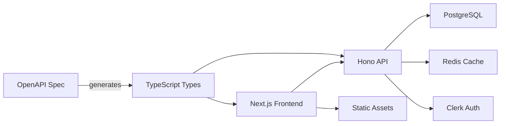

# システム概要・アーキテクチャ

> プロジェクトの全体アーキテクチャ・設計方針

## 🎯 システム概要

### プロジェクトの特徴

- **フルスタック**: Next.js + Hono による統合開発環境
- **型安全**: TypeScript + OpenAPI による型安全な開発
- **モダンスタック**: React 19、Next.js 15 対応
- **開発効率**: モノレポ構成による統合管理

### アーキテクチャ原則

1. **型安全性**: OpenAPI仕様から自動生成による型安全性
2. **関心の分離**: フロントエンド・バックエンドの明確な分離
3. **開発効率**: 自動化とツール活用による高速開発
4. **拡張性**: スケーラブルな設計

## 🏗️ プロジェクト構成

### モノレポ構造

```
.
├─ apps/
│  ├─ frontend/                 # Next.js 15 アプリ
│  └─ backend/                  # Hono バックエンド（オプション）
├─ packages/
│  ├─ ui/                       # 共有UIコンポーネント（React + Tailwind）
│  ├─ shared/                   # 型定義・ユーティリティ
│  │  └─ api-client/            # OpenAPI生成クライアント
│  └─ config/                   # 共通設定（ESLint / TypeScript）
├─ contracts/                   # OpenAPI仕様（API契約）
├─ tools/
│  └─ codegen/                  # コード生成スクリプト
├─ scripts/                     # 開発・デプロイスクリプト
├─ infra/
│  └─ docker/                   # Docker 環境設定
├─ docs/                        # プロジェクトドキュメント
└─ .kiro/                       # Kiro 設定
```

## 🛠️ 技術スタック

### フロントエンド

- **Framework**: Next.js 15 (App Router)
- **UI Library**: React 19
- **Styling**: Tailwind CSS
- **Type Safety**: TypeScript
- **State Management**: Zustand / React Query

### バックエンド

- **Runtime**: Node.js / Bun
- **Framework**: Hono
- **Database**: PostgreSQL + Prisma
- **Authentication**: Clerk
- **Cache**: Redis

### 開発ツール

- **Package Manager**: pnpm (workspace)
- **Code Generation**: OpenAPI Generator
- **Linting**: ESLint + Prettier
- **Testing**: Vitest / Jest
- **Container**: Docker + Docker Compose

## 🔄 データフロー



## 🚀 デプロイメント

### 開発環境

- **Frontend**: `pnpm dev` (localhost:3000)
- **Backend**: `pnpm dev:api` (localhost:8000)
- **Database**: Docker Compose (PostgreSQL + Redis)

### 本番環境

- **Frontend**: Vercel / Netlify
- **Backend**: Vercel Functions / Railway / Render
- **Database**: Neon / Supabase / Railway
- **Cache**: Upstash Redis

## 🔐 セキュリティ

### 認証・認可

- **Authentication**: Clerk による認証
- **Session Management**: JWT トークン
- **API Protection**: 認証ミドルウェア

### データ保護

- **Input Validation**: Zod スキーマバリデーション
- **SQL Injection**: Prisma ORM による保護
- **CORS**: 適切な CORS 設定

## 📊 監視・ログ

- **Error Tracking**: Sentry（推奨）
- **Analytics**: Google Analytics / Vercel Analytics
- **Logs**: 構造化ログ（Pino）
- **Performance**: Core Web Vitals 監視

## 🔗 関連ドキュメント

- [要件定義](./requirements.md)
- [API設計](./api-design.md)