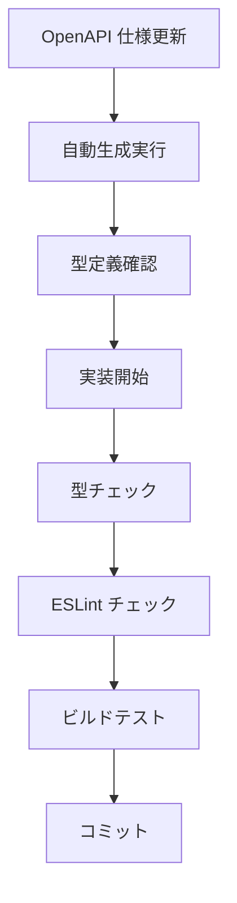

# 実装ガイドライン

> AI Agent SNS プロジェクトにおける実装者向けの包括的ガイドライン。TypeScript 型安全性、ESLint 設定最適化、Next.js 15 対応の知見を体系化。

## 🎯 基本方針

### 1. 型安全性ファースト

- **any 型完全禁止** - `unknown` 型で置換し、型ガードで安全に変換
- **型アサーション → 型ガード** - ランタイム安全性を確保
- **OpenAPI 自動生成** - 手動型定義禁止、仕様駆動開発
- **Prisma 境界制御** - server層での型安全なDB操作

### 2. 設定レベル解決

- **個別 ESLint コメント最小化** - 設定ファイルで統一管理
- **境界層での適切な制約** - アーキテクチャ層ごとの型制約設定
- **モノレポ統一設定** - packages 間での一貫した品質基準
- **生成物境界制御** - generated/ フォルダの統一除外設定

### 3. Server境界層原則

- **Reactからの直接DB禁止** - サーバー境界層経由のみ
- **パスエイリアス活用** - 将来の移行に備えた抽象化
- **ランタイム明示** - Prisma使用時は `nodejs` 指定必須

---

## 🔧 TypeScript 実装パターン

### ✅ 推奨パターン

#### 1. 型ガードによる安全な型変換

**型ガード実装方針**:
型アサーションを避け、型ガード関数による安全な型変換を実装。unknown型でデータを受け取り、type predicate（`data is SomeType`）を使った判定関数を作成。オブジェクトの存在確認、プロパティの存在チェックを含む包括的な検証ロジックで、ランタイム安全性を確保した型変換システムを構築。

#### 2. 環境変数の型安全なアクセス

**環境変数アクセス方針**:
TypeScript 5.x対応として、ドット記法でのprocess.env アクセスを避け、ブラケット記法による環境変数参照を実装。コンパイラ警告を回避し、動的なキー指定にも対応できる安全なアクセスパターンを採用。

#### 3. Next.js 15 API Routes

**Next.js 15 対応API Routes設計方針**:
型制約として`params: Promise<Record<string, string | string[]>>`を必須とし、ジェネリック型による柔軟な拡張性を確保。未使用パラメータは`_params`のようなアンダースコア命名でESLint警告を回避し、logger等の追加コンテキストをtype intersection（`T & { logger: Logger }`）で型安全に拡張する設計を実装。

#### 4. Zod スキーマ活用

**Zodスキーマベース変換システム**:
boundary層での外部データ変換にZodスキーマを活用。ジェネリック型`T extends z.ZodTypeAny`による柔軟な型制約、`z.infer<T>`による自動型推論、`schema.parse()`による実行時検証を組み合わせ、JSON文字列からの型安全な変換システムを実装。

#### 5. Prisma Server境界層パターン

**Prismaクライアント境界層設計**:
server境界層での統一されたPrismaクライアント管理を実装。開発環境でのグローバルインスタンス再利用、環境別ログレベル設定、パスエイリアス（@db）による抽象化を含むクライアント初期化システムを構築。

**ビジネスロジック層設計**:
database操作を専用関数として分離し、パスエイリアス経由でのPrismaアクセス、型安全なクエリ実行、関連データのinclude指定を含む包括的なデータアクセス層を実装。

**API Routes統合設計**:
`runtime = 'nodejs'`必須指定、ビジネスロジック層からの関数import、URL パラメータの型安全な取得、適切なエラーハンドリングとJSONレスポンス返却を含む統合APIエンドポイントを実装。

#### 6. パスエイリアス移行対応（将来のパターン）

**段階的パスエイリアス設計**:
現在は@dbでPrismaクライアント、@/libでビジネスロジック関数の分離を実装。将来のGo移行時には@dbエイリアス下での統合を予定し、型定義も@db/types経由でのアクセスに移行計画。相対パス指定を避け、エイリアスによる抽象化で移行時の影響を最小化する設計を採用。

### 🚫 禁止パターン

#### 1. any 型の使用

**any型禁止・unknown型採用方針**:
any型による型安全性の放棄を完全禁止し、unknown型による厳密な型制御を実装。型ガード関数による実行時検証、例外処理による安全なエラーハンドリング、型安全性を保持した柔軟なデータ処理システムを構築。

#### 2. 型アサーション乱用

**型アサーション禁止・スキーマ検証採用方針**:
型アサーション（`as`キーワード）によるランタイム安全性の欠如を回避し、Zodスキーマを使った実行時検証による型安全なデータ変換を実装。スキーマベース検証により、実際のデータ構造と型定義の整合性を保証する堅牢なシステムを構築。

#### 3. Prisma不適切使用

**Prisma境界制御・適切使用方針**:
Reactコンポーネントからの直接Prismaアクセスを完全禁止し、server境界層経由でのみアクセス可能とする設計を実装。Edge Runtimeでの使用制限、パスエイリアス必須化による抽象化、Node.js Runtimeでのビジネスロジック層経由アクセスを含む適切なPrisma使用パターンを確立。

---

## 📋 ESLint 設定戦略

### 1. ディレクトリ別制約

**階層別ESLint制約設計**:
アプリケーションコードには厳格な型制約（any型禁止、型アサーション禁止、unsafe return禁止）を適用。boundary層では設計上必要な制約緩和（unsafe return許可、型アサーション許可）を実装。生成ファイルの自動除外設定により、Prisma・OpenAPI生成物へのlint適用を回避する階層化された制約システムを構築。

### 2. モノレポ統一設定

**パッケージ統一制約設計**:
packages配下の全TypeScriptファイルに対する統一ESLint設定を実装。TypeScriptパーサー設定、複数tsconfig.jsonファイルの統合プロジェクト参照、パッケージ間で一貫した厳格ルール適用による品質統一化システムを構築。

---

## 🏗️ アーキテクチャ実装ルール

### 1. 層別責務

#### Apps Layer (apps/frontend)

- **UI コンポーネント**: 表示ロジックのみ
- **API Routes**: ビジネスロジック実装
- **Pages**: ルーティング・認証チェック

#### Packages Layer (packages/\*)

- **shared**: 型定義・ユーティリティ
- **ui**: 再利用可能コンポーネント
- **config**: 共通設定

#### Boundary Layer (apps/frontend/src/boundary)

- **目的**: 外部データの型安全な変換
- **制約**: 型制約は ESLint 設定レベルで緩和
- **パターン**: Zod スキーマによる検証

### 2. 自動生成ファイル管理

**自動生成ワークフロー管理**:
OpenAPIからTypeScript型定義、Zodスキーマ、APIクライアントを順次生成する3段階のワークフローを実装。`pnpm generate:types`、`pnpm generate:schemas`、`pnpm generate:client`の順序実行による依存関係を考慮した生成システムを構築。

**生成ファイル（編集禁止）**:

- `src/types/api.ts`
- `src/schemas/api.ts`
- `src/lib/api-client.ts`

---

## 🔍 品質保証チェックリスト

### 必須チェック項目

**5段階品質保証チェックシステム**:
型チェック（`pnpm type-check`）でエラー0件、ESLintチェック（`pnpm lint`）でエラー・警告0件、自動生成更新（`pnpm codegen && pnpm db:generate`）で差分なし、ビルド（`pnpm build`）で成功、Prisma設定確認（`prisma generate --dry-run`）でserver境界層出力確認を含む包括的な品質保証手順を実装。

### コード品質基準

- **型安全性**: 100% - any 型完全排除
- **ESLint 準拠**: 100% - 全ルール遵守
- **自動生成整合性**: 100% - OpenAPI 仕様との一致
- **Next.js 15 対応**: 100% - API Routes・環境変数アクセス

---

## 🚀 実装フロー

### 1. 機能開発

### 2. 品質問題対応

**優先度**: 設定レベル > 型ガード > ESLint コメント

1. **設定レベル**: `.eslintrc.cjs` での統一解決
2. **型ガード**: ランタイム安全性確保
3. **ESLint コメント**: 最後の手段として最小限使用

### 3. デバッグ手順

**4段階デバッグプロセス**:
型エラー解決（`pnpm type-check`）、Lintエラー自動修正（`pnpm lint --fix`）、自動生成更新（`pnpm generate:all`）、最終ビルド確認（`pnpm build`）の順序実行による系統的なエラー解決手順を実装。

---

## 🛡️ トラブルシューティング

### よくある問題と解決策

| 問題                 | 原因            | 解決策                    |
| -------------------- | --------------- | ------------------------- |
| `any` 型警告         | 型推論失敗      | `unknown` + 型ガード      |
| 型アサーション警告   | 非安全な変換    | スキーマ検証実装          |
| API Route 型エラー   | Next.js 15 制約 | `params: Promise<>` 対応  |
| 環境変数エラー       | TS 5.x 制約     | `process.env['KEY']` 記法 |
| ESLint パース エラー | 設定競合        | 重複設定ファイル削除      |

### 緊急時対応

**緊急時3パターン対応システム**:
型エラー大量発生時は自動生成更新（`pnpm generate:all`）とエラー箇所確認を実行。ESLintエラー大量発生時は自動修正（`pnpm lint --fix`）後に設定レベル解決を検討。ビルド失敗時は型チェック、ESLint、依存関係確認の3段階トラブルシューティングを実施する緊急対応プロセスを確立。

---

## 📚 参考資料

### 関連ドキュメント

- **[CLAUDE.md](./CLAUDE.md)**: プロジェクト作業方針
- **[README.md](./README.md)**: セットアップ・使用方法
- **[design-architecture.md](./.kiro/specs/ai-agent-sns/design-architecture.md)**: アーキテクチャ設計
- **[design-testing.md](./.kiro/specs/ai-agent-sns/design-testing.md)**: 品質保証戦略

### 技術スタック公式ドキュメント

- [TypeScript Handbook](https://www.typescriptlang.org/docs/)
- [Next.js 15 Documentation](https://nextjs.org/docs)
- [ESLint TypeScript Rules](https://typescript-eslint.io/rules/)
- [Zod Documentation](https://zod.dev/)

---

**🎯 このガイドラインに従うことで、型安全で保守性の高い実装を実現できます。**
