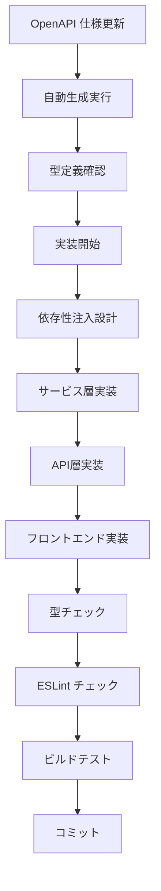

# 実装ガイドライン

> AI Agent SNS プロジェクトにおける実装者向けの包括的ガイドライン。TypeScript 型安全性、ESLint 設定最適化、Next.js 15 対応の知見を体系化。

## 🎯 全体共通原則

### 1. 型安全性ファースト

- **any 型完全禁止** - `unknown` 型で置換し、型ガードで安全に変換
- **型アサーション → 型ガード** - ランタイム安全性を確保
- **OpenAPI 自動生成** - 手動型定義禁止、仕様駆動開発
- **Result型エラーハンドリング** - 明示的な成功・失敗処理

### 2. 設定・品質管理

- **個別 ESLint コメント最小化** - 設定ファイルで統一管理
- **境界層での適切な制約** - アーキテクチャ層ごとの型制約設定
- **モノレポ統一設定** - packages 間での一貫した品質基準
- **生成物境界制御** - generated/ フォルダの統一除外設定

### 3. 依存性注入・疎結合

- **インターフェースベース設計** - 実装への直接依存を避ける
- **設定オブジェクト注入** - ハードコード設定値を禁止
- **テスト可能性重視** - モック・スタブ対応の設計

## 🖥️ サーバー固有ルール（Backend/API）

### Hono + Node.js 実装方針

#### 1. 境界層・ランタイム制御

- **Prisma境界制御** - server層での型安全なDB操作
- **ランタイム明示** - Prisma使用時は `runtime = 'nodejs'` 指定必須
- **Edge Runtime禁止** - Prisma使用箇所でのEdge Runtime使用禁止

#### 2. API設計パターン

- **OpenAPIファースト** - 仕様定義 → 型生成 → 実装の順序
- **依存性注入必須** - マネージャーパターンによるサービス管理
- **非同期処理制御** - Promise.race/allによるタイムアウト・並列実行
- **構造化ログ** - Pinoによる構造化ログ、機密情報マスキング

#### 3. サービス管理

- **サービス登録パターン** - 統一されたサービスインターフェース
- **環境別設定対応** - 開発・本番・テスト環境の設定分離
- **キャッシュ戦略** - インメモリ → Redis移行可能な抽象化

## 🌐 クライアント固有ルール（Frontend/Next.js）

### Next.js 15 + React 対応方針

#### 1. Next.js 15 制約対応

- **API Routes型制約** - `params: Promise<Record<string, string | string[]>>` 必須
- **環境変数アクセス** - `process.env['KEY']` ブラケット記法
- **Server Actions** - 型安全なサーバーアクション実装

#### 2. API通信パターン

- **openapi-fetch活用** - 型安全なAPIクライアント
- **Result型エラーハンドリング** - success/errorの明示的分岐
- **型ガードによる安全処理** - unknown型からの安全な型変換
- **ローディング状態管理** - 適切なUI状態表現

#### 3. React設計方針

- **コンポーネント責任分離** - 表示・ロジック・状態の分離
- **カスタムフック活用** - 再利用可能なロジックの抽象化
- **型安全なPropsデザイン** - 厳密な型定義とバリデーション
- **アクセシビリティ対応** - WCAG 2.1 AA準拠

#### 4. 状態・エラー管理

- **ローカル状態優先** - useState/useReducerの適切な使用
- **エラー境界実装** - React Error Boundaryによるエラー捕捉
- **楽観的更新パターン** - ユーザー体験向上のための先行更新

---

## 🔧 実装パターン詳細

### ✅ 共通推奨パターン

#### 1. 型ガードによる安全な型変換

**型ガード実装方針**:
型アサーションを避け、型ガード関数による安全な型変換を実装。unknown型でデータを受け取り、type predicate（`data is SomeType`）を使った判定関数を作成。オブジェクトの存在確認、プロパティの存在チェックを含む包括的な検証ロジックで、ランタイム安全性を確保した型変換システムを構築。

#### 2. 環境変数アクセス（共通）

**TypeScript 5.x対応アクセス方針**:
ドット記法でのprocess.env アクセスを避け、ブラケット記法による環境変数参照を実装。コンパイラ警告を回避し、動的なキー指定にも対応できる安全なアクセスパターンを採用。

```typescript
// ❌ TypeScript 5.x で警告が出るパターン
process.env.NEXT_PUBLIC_API_URL

// ✅ 推奨パターン
process.env['NEXT_PUBLIC_API_URL']
```

#### 3. Zod スキーマ活用

**Zodスキーマベース変換システム**:
boundary層での外部データ変換にZodスキーマを活用。ジェネリック型`T extends z.ZodTypeAny`による柔軟な型制約、`z.infer<T>`による自動型推論、`schema.parse()`による実行時検証を組み合わせ、JSON文字列からの型安全な変換システムを実装。

### 🖥️ サーバー固有実装パターン

#### 1. Prisma境界層パターン

**サーバー境界層設計**:
server境界層での統一されたPrismaクライアント管理を実装。開発環境でのグローバルインスタンス再利用、環境別ログレベル設定、パスエイリアス（@db）による抽象化を含むクライアント初期化システムを構築。

```typescript
// ✅ サーバー側Prisma使用パターン
export const runtime = 'nodejs' // 必須指定

// ビジネスロジック層
export async function getUserById(id: string) {
  const user = await prisma.user.findUnique({
    where: { id },
    include: { posts: true },
  })
  return user
}
```

#### 2. 依存性注入パターン

**サービス管理設計**:
マネージャークラスによるサービス登録、コンテキスト注入、設定オブジェクト管理を実装。

```typescript
// サービス定義
interface HealthCheckService {
  name: string
  check: (context: HealthCheckContext) => Promise<ServiceHealth>
  required?: boolean
}

// マネージャー使用例
const manager = new HealthCheckManager(config, logger, cache)
manager.registerService(databaseHealthService)
const result = await manager.checkHealth()
```

### 🌐 クライアント固有実装パターン

#### 1. Next.js 15 API Routes

**API Routes型制約パターン**:
Next.js 15の型制約に対応した実装パターン。

```typescript
// ✅ Next.js 15対応パターン
export async function GET(
  request: Request,
  { params }: { params: Promise<{ id: string }> }
) {
  const { id } = await params
  // 実装...
}
```

#### 2. Result型エラーハンドリング

**型安全エラー処理パターン**:
openapi-fetchと組み合わせたResult型パターン。

```typescript
// Result型定義
type ApiResult<T> =
  | { success: true; data: T; error: null }
  | { success: false; data: null; error: ApiError }

// 使用例
const result = await getDetailedHealth()
if (result.success) {
  // result.data は T 型で安全にアクセス可能
  console.log(result.data.status)
} else {
  // result.error は ApiError 型
  console.error(result.error.message)
}
```

#### 3. React状態管理パターン

**コンポーネント状態設計**:
型安全な状態管理とエラーハンドリング。

```typescript
interface ComponentState {
  isLoading: boolean
  result: ApiResult<DataType> | null
  lastUpdated: Date | null
}

const [state, setState] = useState<ComponentState>({
  isLoading: false,
  result: null,
  lastUpdated: null,
})
```

---

### 🚫 共通禁止パターン

#### 1. any型の使用

```typescript
// ❌ 絶対禁止
function processData(data: any) {
  return data.something
}

// ✅ unknown で受け取り、型ガードで安全に処理
function processData(data: unknown) {
  if (isValidData(data)) {
    return data.something
  }
  throw new Error('Invalid data')
}
```

#### 2. 型アサーション乱用

```typescript
// ❌ ランタイム安全性なし
const result = response.data as ApiResponse

// ✅ スキーマ検証付き
const result = ApiResponseSchema.parse(response.data)
```

### 🚫 サーバー固有禁止パターン

#### 1. Edge RuntimeでのPrisma使用

```typescript
// ❌ 禁止：Edge RuntimeでPrisma
export const runtime = 'edge' // Prismaと併用不可

// ✅ Node.js Runtimeを明示
export const runtime = 'nodejs'
```

#### 2. 密結合なサービス設計

```typescript
// ❌ 直接依存・ハードコード
async function checkDatabase() {
  const result = await prisma.user.count() // 直接依存
  console.log('Database OK') // ハードコードログ
}

// ✅ 依存性注入
async function checkDatabase(context: HealthCheckContext) {
  const result = await context.database.count()
  context.logger('Database check completed')
}
```

### 🚫 クライアント固有禁止パターン

#### 1. 不適切なエラー処理

```typescript
// ❌ try-catchによる制御フロー
try {
  const data = await fetchApi()
  setState({ data, error: null })
} catch (error) {
  setState({ data: null, error })
}

// ✅ Result型による明示的処理
const result = await fetchApi()
if (result.success) {
  setState({ data: result.data, error: null })
} else {
  setState({ data: null, error: result.error })
}
```

#### 2. 不適切な状態管理

```typescript
// ❌ 複雑な状態オブジェクト
const [isLoading, setIsLoading] = useState(false)
const [data, setData] = useState(null)
const [error, setError] = useState(null)
const [lastUpdated, setLastUpdated] = useState(null)

// ✅ 統合された状態管理
const [state, setState] = useState<ComponentState>({
  isLoading: false,
  data: null,
  error: null,
  lastUpdated: null,
})
```

---

## 📋 ESLint 設定戦略

### 1. ディレクトリ別制約

**階層別ESLint制約設計**:
アプリケーションコードには厳格な型制約（any型禁止、型アサーション禁止、unsafe return禁止）を適用。boundary層では設計上必要な制約緩和（unsafe return許可、型アサーション許可）を実装。生成ファイルの自動除外設定により、Prisma・OpenAPI生成物へのlint適用を回避する階層化された制約システムを構築。

### 2. モノレポ統一設定

**パッケージ統一制約設計**:
packages配下の全TypeScriptファイルに対する統一ESLint設定を実装。TypeScriptパーサー設定、複数tsconfig.jsonファイルの統合プロジェクト参照、パッケージ間で一貫した厳格ルール適用による品質統一化システムを構築。

---

## 🏗️ アーキテクチャ実装ルール

### 1. 層別責務

#### Apps Layer (apps/frontend)

- **UI コンポーネント**: 表示ロジックのみ
- **API Routes**: ビジネスロジック実装
- **Pages**: ルーティング・認証チェック

#### Packages Layer (packages/\*)

- **shared**: 型定義・ユーティリティ
- **ui**: 再利用可能コンポーネント
- **config**: 共通設定

#### Boundary Layer (apps/frontend/src/boundary)

- **目的**: 外部データの型安全な変換
- **制約**: 型制約は ESLint 設定レベルで緩和
- **パターン**: Zod スキーマによる検証

### 2. 自動生成ファイル管理

**自動生成ワークフロー管理**:
OpenAPIからTypeScript型定義、Zodスキーマ、APIクライアントを順次生成する3段階のワークフローを実装。`pnpm generate:types`、`pnpm generate:schemas`、`pnpm generate:client`の順序実行による依存関係を考慮した生成システムを構築。

**生成ファイル（編集禁止）**:

- `src/types/api.ts`
- `src/schemas/api.ts`
- `src/lib/api-client.ts`

---

## 🔍 品質保証チェックリスト

### 必須チェック項目

**6段階品質保証チェックシステム**:
型チェック（`pnpm type-check`）でエラー0件、ESLintチェック（`pnpm lint`）でエラー・警告0件、自動生成更新（`pnpm codegen && pnpm db:generate`）で差分なし、ビルド（`pnpm build`）で成功、依存性注入テスト（新しいサービス追加の簡単さ）、Result型エラーハンドリングの網羅性確認を含む包括的な品質保証手順を実装。

### API実装品質基準

- **依存性注入**: 100% - 外部依存の抽象化完了
- **非同期処理**: 100% - Promise.all/raceの適切な使用
- **エラーハンドリング**: 100% - Result型による明示的処理
- **環境設定**: 100% - 環境別設定対応
- **テスト可能性**: 100% - モック・スタブ対応可能

### コード品質基準

- **型安全性**: 100% - any 型完全排除
- **ESLint 準拠**: 100% - 全ルール遵守
- **自動生成整合性**: 100% - OpenAPI 仕様との一致
- **Next.js 15 対応**: 100% - API Routes・環境変数アクセス

---

## 🚀 実装フロー

### 1. 機能開発



### 2. API実装フロー

**ヘルスチェックAPI実装例**:

1. **型定義・インターフェース設計** (`types.ts`)
   - サービス定義、設定、コンテキストの型定義
   - 依存性注入のための抽象化インターフェース

2. **サービス層実装** (`services.ts`)
   - 個別サービスチェック関数（async/await）
   - キャッシュ対応、タイムアウト制御
   - エラーハンドリング

3. **マネージャー実装** (`manager.ts`)
   - サービス登録・管理
   - 並列実行制御（Promise.all/race）
   - 結果統合・ステータス判定

4. **設定管理** (`config.ts`)
   - 環境別設定
   - バリデーション
   - デフォルト値管理

5. **API層統合** (`routes/*.ts`)
   - マネージャーのインスタンス化
   - HTTPレスポンス生成
   - エラー境界処理

### 2. 品質問題対応

**優先度**: 設定レベル > 型ガード > ESLint コメント

1. **設定レベル**: `.eslintrc.cjs` での統一解決
2. **型ガード**: ランタイム安全性確保
3. **ESLint コメント**: 最後の手段として最小限使用

### 3. デバッグ手順

**4段階デバッグプロセス**:
型エラー解決（`pnpm type-check`）、Lintエラー自動修正（`pnpm lint --fix`）、自動生成更新（`pnpm generate:all`）、最終ビルド確認（`pnpm build`）の順序実行による系統的なエラー解決手順を実装。

---

## 🛡️ トラブルシューティング

### よくある問題と解決策

| 問題                 | 原因                   | 解決策                          |
| -------------------- | ---------------------- | ------------------------------- |
| `any` 型警告         | 型推論失敗             | `unknown` + 型ガード            |
| 型アサーション警告   | 非安全な変換           | スキーマ検証実装                |
| API Route 型エラー   | Next.js 15 制約        | `params: Promise<>` 対応        |
| 環境変数エラー       | TS 5.x 制約            | `process.env['KEY']` 記法       |
| ESLint パース エラー | 設定競合               | 重複設定ファイル削除            |
| 依存性注入エラー     | 密結合設計             | インターフェース抽象化          |
| Promise タイムアウト | 非同期処理制御不足     | Promise.race + timeout 実装     |
| Result型処理漏れ     | エラーハンドリング不備 | success/error 分岐の網羅的処理  |
| 環境別設定エラー     | ハードコード設定       | 設定オブジェクト + 環境変数対応 |
| テスト困難           | 静的依存               | 依存性注入 + モック対応設計     |

### 緊急時対応

**緊急時3パターン対応システム**:
型エラー大量発生時は自動生成更新（`pnpm generate:all`）とエラー箇所確認を実行。ESLintエラー大量発生時は自動修正（`pnpm lint --fix`）後に設定レベル解決を検討。ビルド失敗時は型チェック、ESLint、依存関係確認の3段階トラブルシューティングを実施する緊急対応プロセスを確立。

---

## 📚 参考資料

### 関連ドキュメント

- **[CLAUDE.md](./CLAUDE.md)**: プロジェクト作業方針
- **[README.md](./README.md)**: セットアップ・使用方法
- **[design-architecture.md](./.kiro/specs/ai-agent-sns/design-architecture.md)**: アーキテクチャ設計
- **[design-testing.md](./.kiro/specs/ai-agent-sns/design-testing.md)**: 品質保証戦略

### 技術スタック公式ドキュメント

- [TypeScript Handbook](https://www.typescriptlang.org/docs/)
- [Next.js 15 Documentation](https://nextjs.org/docs)
- [ESLint TypeScript Rules](https://typescript-eslint.io/rules/)
- [Zod Documentation](https://zod.dev/)

---

**🎯 このガイドラインに従うことで、型安全で保守性の高い実装を実現できます。**
